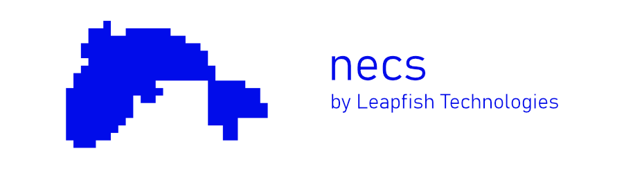

# NECS

> A golang library for multiplayer games that use the Donburi ECS.
Networked Entity Component System; a networking layer for [donburi](https://github.com/yohamta/donburi).
The goal with this project is to simplify the development of multiplayer games and experiences in Go.

## 🐱‍👓 Features
* Automatic synchronization of an ECS world.
* Filtering streamed entities to clients.
* Type safe network event handling.
* Works in WASM!

> See a live demo @ [example.leap.fish/](https://example.leap.fish/)

## 📝 Documentation
Documentation is still a work in progress.

### Basic server and client
To setup a very simple server and client, refer to the [examples](/examples)
### Full scale project
There is a [full scale project](https://github.com/leap-fish/necs-example) which shows how to setup a server, client and network entities between them.

## ❓ Support and help
> We have a public discord related to Leapfish: https://discord.gg/QS4rNVhC9y

## 🏗️ Contributions
> We appreciate any contributions to the project.
> Open a pull request, or issue with enough context for maintainers to know what
> you're aiming to achieve.
